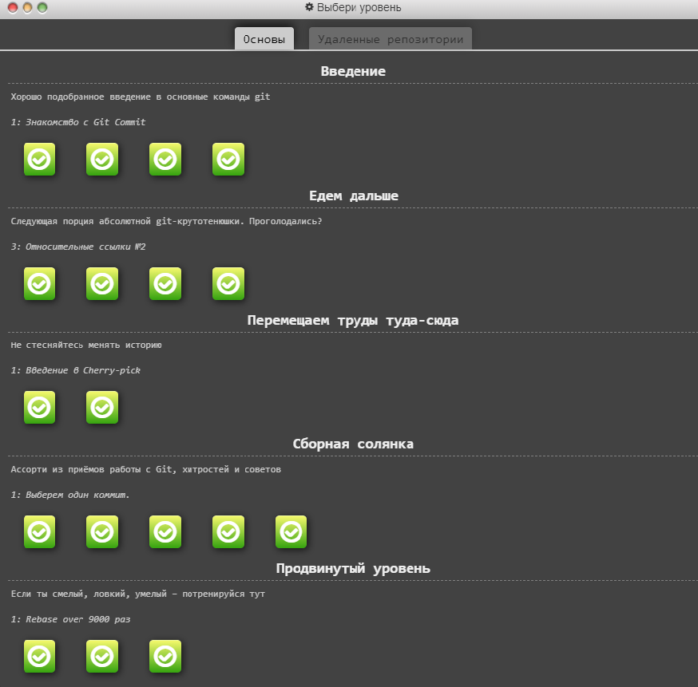
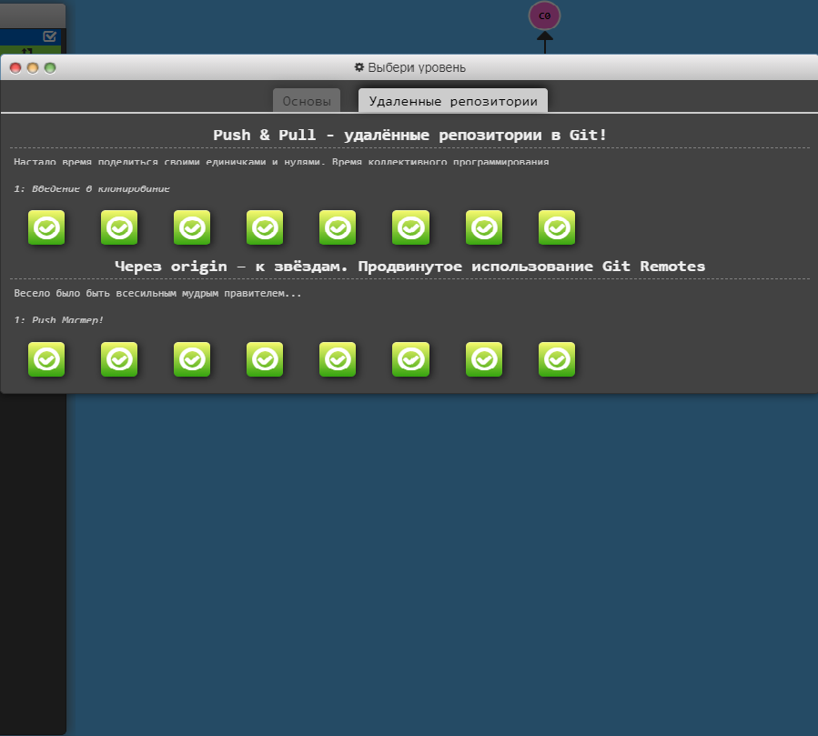

# kottans-frontend
## Stage 0. Self-Study
### General
0. [x] [Git Basics](#git-basics)
1. [ ] Linux CLI and Networking
2. [ ] VCS (hello gitty), GitHub and Collaboration
### Front-End Basics
3. [ ] Intro to HTML & CSS
4. [ ] Responsive Web Design
5. [ ] HTML & CSS Practice
6. [ ] JavaScript Basics
7. [ ] Document Object Model - practice
### Advanced Topics
8. [ ] Building a Tiny JS World (pre-OOP) - practice
9. [ ] Object oriented JS - practice
10. [ ] OOP exercise - practice
11. [ ] Offline Web Applications
12. [ ] Memory pair game — real project!
13. [ ] Website Performance Optimization
14. [ ] Friends App - real project!
***
### Git Basics
I already know a little about Git but the course at UDACITY and learngitbranching.js.org helped me better understand the basic concepts of Git and what a powerful and at the same time flexible this tool is.

Also, I've learned a lot of new useful commands, and put my knowledge in some order.

  
VCS with Git

  

  
Main

  

  
Remote

  

