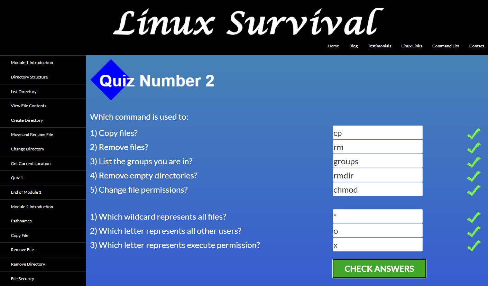

# kottans-frontend
## Stage 0. Self-Study
### General
0. [x] [Git Basics](#git-basics)
1. [x] [Linux CLI and Networking](#linux-cli-and-http)
2. [x] [VCS (hello gitty), GitHub and Collaboration](#git-collaboration)
### Front-End Basics
3. [x] [Intro to HTML & CSS](#intro-to-html-and-css)
4. [ ] Responsive Web Design
5. [ ] HTML & CSS Practice
6. [ ] JavaScript Basics
7. [ ] Document Object Model - practice
### Advanced Topics
8. [ ] Building a Tiny JS World (pre-OOP) - practice
9. [ ] Object oriented JS - practice
10. [ ] OOP exercise - practice
11. [ ] Offline Web Applications
12. [ ] Memory pair game — real project!
13. [ ] Website Performance Optimization
14. [ ] Friends App - real project!
***
## Git Basics
I already know a little about Git but the course at UDACITY and learngitbranching.js.org helped me better understand the basic concepts of Git and what a powerful and at the same time flexible this tool is.

Also, I've learned a lot of new useful commands, and put my knowledge in some order.

  
VCS with Git

  

  
Main

  

  
Remote

  

## Linux CLI, and HTTP
#### Linux CLI
During the Linux Survival tutorial I've learned basic commands, find out about security mode, and how to change it.

Unfortunately, I couldn't practice Linux commands properly, since I am a Windows user. But if I should work with Linux in the future, it won`t be so new to me.

  
Module 1

  

  
Module 2

  

  
Module 3

  

  
Module 4

  

#### HTTP

The articles are very interesting. Now I have a general idea of HTTP and HTTPS. Definitely, I'll come back to this later for a better understanding.

## Git Collaboration
After this course, I feel much more comfortable working with remote repositories. 

Also, I have learned how to contribute to a public project in the right way and some cool rebase commands.

  
GitHub & Collaboration

  

  
Main

  

  
Remote

  

## Intro to HTML and CSS
Most of this information was familiar to me, but it was nice to refresh my knowledge.

Also, I didn't know anything about grid, now I understand how it works and I intend to use it in the future.

  
Intro to HTML & CSS

  

  
Learn HTML

  

  
Learn CSS

  

